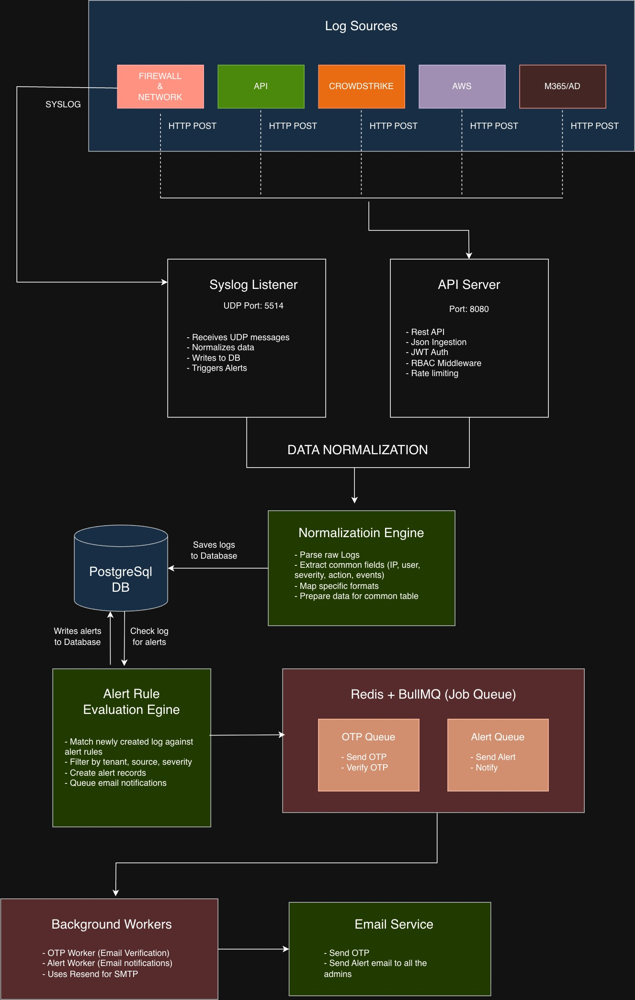

# System Architecture - Multi-Tenant Log Management System

## Overview

A multi-tenant Security Information and Event Management (SIEM) platform that ingests, normalizes, stores, and analyzes logs from multiple sources (Firewall, API, CrowdStrike, AWS, M365, AD, Network). The system provides real-time alerting, role-based access control (RBAC), and comprehensive log querying capabilities.

---

## Architecture Diagram





---

## Data Flow

### 1. **Log Ingestion Flow**

```
┌─────────────┐
│  Log Source │
└──────┬──────┘
       │
       │ (1) Send syslog (UDP:5514) or HTTP POST (/admin/ingest)
       │
       ▼
┌─────────────────┐
│ Syslog Listener │ or ┌───────────┐
│  (syslog.js)    │    │API Server │
└──────┬──────────┘    └─────┬─────┘
       │                     │
       │ (2) Parse raw message
       │
       ▼
┌──────────────────────┐
│ Normalization Engine │
│  (normalizeService)  │
└──────┬───────────────┘
       │
       │ (3) Extract fields:
       │     • tenant, source, severity
       │     • srcIp, dstIp, user, host
       │     • action, eventType, etc.
       │
       ▼
┌──────────────────────┐
│  LogService.createLog│
└──────┬───────────────┘
       │
       │ (4) Insert into PostgreSQL (logs table)
       │
       ▼
┌──────────────────────┐
│  Database (Neon)     │
└──────┬───────────────┘
       │
       │ (5) Trigger alert check
       │
       ▼
┌──────────────────────┐
│ AlertService         │
│  .checkAlertRules()  │
└──────┬───────────────┘
       │
       │ (6) Match against AlertRules
       │     (tenant + source + severity >= threshold)
       │
       ▼
┌──────────────────────┐
│  Create Alert record │
└──────┬───────────────┘
       │
       │ (7) Queue email job (BullMQ)
       │
       ▼
┌──────────────────────┐
│  Redis Queue         │
└──────┬───────────────┘
       │
       │ (8) Alert Worker processes job
       │
       ▼
┌──────────────────────┐
│  EmailService        │
│  .sendAlertEmail()   │
└──────┬───────────────┘
       │
       │ (9) Send to all ADMIN emails
       │
       ▼
┌──────────────────────┐
│  Admin Inboxes       │
└──────────────────────┘
```

### 2. **Alert Rule Evaluation Flow**

```
┌─────────────┐
│  New Log    │
└──────┬──────┘
       │
       ▼
┌──────────────────────┐
│ AlertService         │
│  .checkAlertRules()  │
└──────┬───────────────┘
       │
       │ (1) Fetch all active AlertRules
       │     WHERE tenant = log.tenant
       │     AND logSource = log.source
       │     AND isActive = true
       │
       ▼
┌──────────────────────┐
│  Filter rules        │
└──────┬───────────────┘
       │
       │ (2) For each matching rule:
       │     IF log.severity >= rule.severity
       │
       ▼
┌──────────────────────┐
│  Create Alert        │
│  • alertRuleId       │
│  • logId             │
│  • tenant            │
│  • severity          │
│  • isResolved: false │
└──────┬───────────────┘
       │
       │ (3) Return created alerts
       │
       ▼
┌──────────────────────┐
│  Syslog Listener     │
│  receives alerts[]   │
└──────┬───────────────┘
       │
       │ (4) Fetch all ADMIN users
       │     WHERE role = ADMIN
       │     AND status = ACTIVE
       │     AND isVerified = true
       │
       ▼
┌──────────────────────┐
│  Send email to each  │
│  admin (via BullMQ)  │
└──────────────────────┘
```

### 3. **User Authentication Flow**

```
┌─────────────┐
│   User      │
└──────┬──────┘
       │
       │ (1) POST /auth/signup (email, password, name, tenant)
       │
       ▼
┌─────────────────┐
│  API Server     │
└──────┬──────────┘
       │
       │ (2) Hash password (bcrypt)
       │     Generate OTP code
       │
       ▼
┌──────────────────────┐
│  Save User + OTP     │
│  (isVerified: false) │
└──────┬───────────────┘
       │
       │ (3) Queue OTP email (BullMQ)
       │
       ▼
┌──────────────────────┐
│  OTP Worker          │
└──────┬───────────────┘
       │
       │ (4) Send OTP via email
       │
       ▼
┌──────────────────────┐
│  User's Email        │
└──────┬───────────────┘
       │
       │ (5) POST /auth/verify-otp (email, otpCode)
       │
       ▼
┌──────────────────────┐
│  Verify OTP          │
│  Update isVerified   │
└──────┬───────────────┘
       │
       │ (6) POST /auth/login (email, password)
       │
       ▼
┌──────────────────────┐
│  Validate password   │
│  Generate JWT token  │
└──────┬───────────────┘
       │
       │ (7) Set httpOnly cookie
       │
       ▼
┌──────────────────────┐
│  Return user data    │
└──────────────────────┘
```

---

## Multi-Tenancy Model

### Logical Isolation (Shared Database)

This system uses **logical isolation** where all tenants share the same PostgreSQL database. Tenant separation is enforced at the **application layer**.

#### Tenant Enum
```prisma
enum Tenant {
  TENANT1
  TENANT2
  TENANT3
  TENANT4
}
```

#### Access Control Rules

| Role  | Access Level                                      |
|-------|---------------------------------------------------|
| ADMIN | Can see **ALL logs** across all tenants           |
|       | Can create/update/delete users, alerts, rules     |
|       | Can ingest logs, manage system settings           |
| USER  | Can **ONLY see logs** from their own tenant       |
|       | Can query logs, view alerts for their tenant      |
|       | Cannot create users or modify alert rules         |

#### Data Isolation Guarantees

1. **User Creation**: Each user is assigned a `tenant` field during signup
2. **Log Ingestion**: Each log must have a `tenant` field (validated)
3. **Alert Rules**: Scoped by `tenant` - rules only apply to logs from the same tenant
4. **Query Filtering**: 
   - USER role: Automatically filtered by `user.tenant`
   - ADMIN role: Can query across all tenants

#### Security Considerations

- **No cross-tenant data leakage**: JWT middleware extracts `user.tenant` and enforces filters
- **RBAC enforcement**: Middleware checks `user.role` before allowing operations
- **Database-level constraints**: Foreign keys ensure referential integrity
- **Audit trail**: All logs include `tenant` field for accountability

---

## Technology Stack

### Backend
- **Runtime**: Node.js v18+
- **Framework**: Express.js v5
- **ORM**: Prisma (PostgreSQL client)
- **Authentication**: JWT + bcrypt
- **Queue**: BullMQ + Redis
- **Email**: Resend (transitioning to Nodemailer)
- **Syslog**: Node.js `dgram` (UDP)

### Frontend
- **Framework**: React 19 + TypeScript
- **Styling**: Tailwind CSS v4
- **Animation**: Framer Motion
- **State Management**: Zustand + Redux Toolkit
- **API Client**: Axios + React Query
- **UI Components**: Radix UI + shadcn/ui

### Database
- **Primary**: PostgreSQL 15+ (Neon serverless)
- **Cache/Queue**: Redis 7+

### DevOps
- **CI/CD**: GitHub Actions (planned)
- **Deployment**:
  - Backend: Render
  - Frontend: Vercel
  - Database: Neon

---

## Security Features

1. **Authentication**
   - JWT tokens (httpOnly cookies)
   - OTP-based email verification
   - Password reset via OTP
   - Bcrypt password hashing (10 rounds)

2. **Authorization**
   - Role-Based Access Control (ADMIN vs USER)
   - Tenant-based data isolation
   - Protected routes with middleware

3. **Rate Limiting**
   - Express Rate Limit on auth endpoints
   - Login attempt tracking (max 5 failed attempts)

4. **Security Headers**
   - Helmet.js for HTTP security headers
   - CORS configuration

5. **Input Validation**
   - Syslog message size limits (16KB max)
   - Request validation via middleware

---

## Scalability Considerations

### Current Architecture (Small Scale)
- Single backend instance
- Single syslog listener
- Shared PostgreSQL (Neon)
- Redis for job queuing

### Future Enhancements (Production Scale)
1. **Horizontal Scaling**
   - Multiple backend instances (load balanced)
   - Multiple syslog listeners (UDP load balancing)
   
2. **Database Optimization**
   - Partitioning logs table by `tenant` or `timestamp`
   - TimescaleDB for time-series optimization
   - Read replicas for analytics queries

3. **Log Retention**
   - Archive old logs to S3/object storage
   - Implement TTL policies per tenant

4. **Caching**
   - Redis cache for frequent queries
   - CDN for frontend assets

5. **Observability**
   - Prometheus metrics
   - ELK stack for system logs
   - Distributed tracing (Jaeger)

---

## API Endpoints Summary

### Authentication (`/api/auth`)
- `POST /signup` - Register new user
- `POST /verify-otp` - Verify email OTP
- `POST /login` - Authenticate user
- `POST /forgot-password` - Request password reset
- `POST /reset-password` - Reset password with OTP
- `GET /checkUser` - Verify JWT token

### Admin Routes (`/api/admin`) - ADMIN only
- `POST /ingest` - Manual log ingestion
- `POST /create-rules` - Create alert rule
- `GET /alert-rules` - List alert rules
- `PUT /alert-rules/:id` - Update rule
- `DELETE /alert-rules/:id` - Delete rule
- `GET /alerts` - List all alerts
- `PATCH /alerts/:id/resolve` - Resolve alert
- `POST /create-user` - Create user account
- `GET /users` - List users
- `PUT /update-user/:id` - Update user
- `DELETE /delete-user/:id` - Delete user
- `PATCH /restrict-user/:id` - Restrict/unrestrict user

### User Routes (`/api/user`) - Authenticated
- `GET /get-logs` - Query logs (tenant-filtered for USER role)
- `GET /get-summary` - Dashboard statistics
- `GET /get-logs-alerts` - Combined logs and alerts
- `GET /get-top` - Top IPs and sources
- `GET /recent-alerts` - Recent alert notifications

---

## Component Overview

### Backend Services

| Service | Purpose | Port |
|---------|---------|------|
| `server.js` | Main Express API server | 8080 |
| `syslog.js` | UDP syslog listener | 5514 |
| `otpWorker.js` | BullMQ worker for OTP emails | - |
| `alertWorker.js` | BullMQ worker for alert emails | - |

### Key Services/Utilities

| Module | Responsibility |
|--------|----------------|
| `normalizeService.js` | Parse and normalize raw logs into common schema |
| `logService.js` | CRUD operations for logs |
| `alertService.js` | Alert rule evaluation and creation |
| `emailService.js` | Email sending (OTP, alerts, password reset) |
| `authMiddleware.js` | JWT verification, RBAC checks |

---

## Deployment Architecture

- **Production Deployment**: [setup_saas.md](./setup_saas.md)

---

## Monitoring & Logging

### Application Logs
- **Syslog Listener**: Console logs for incoming messages
- **API Server**: Morgan HTTP request logging
- **Fallback Logs**: File-based fallback when DB is unavailable (`/logs/syslog_fallback.log`)

### Error Handling
- Try-catch blocks with detailed error logging
- Graceful degradation (fallback to file on DB failure)
- Alert email failure logging (non-blocking)

---

## Conclusion

This architecture provides a **scalable, secure, and multi-tenant** log management platform suitable for small to medium deployments. The logical isolation model ensures data privacy while maintaining operational simplicity. The modular design allows for easy extension and integration with existing security infrastructure.
